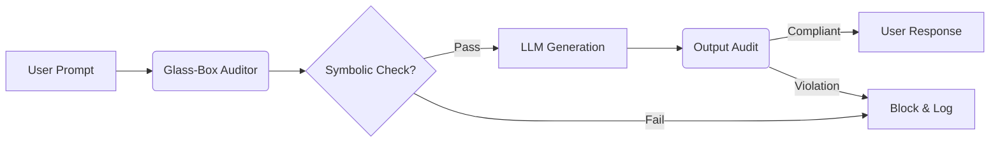

# Glass-Box Audit: Neuro-symbolic Governance for Financial LLMs

[](https://opensource.org/licenses/MIT)
[](https://www.python.org/downloads/release/python-390/)
[]()

**Glass-Box Audit** is a research framework for operationalizing regulatory constraints (e.g., UK FCA Consumer Duty) within autonomous financial agents. Unlike "black box" safety alignment (RLHF), this framework applies a deterministic **Neuro-symbolic logic layer** to audit LLM outputs in real-time, enforcing hard constraints on financial promotions and advice.

---

## 🚀 Key Features

-   **Deterministic Auditing:** Uses symbolic logic rules to strictly enforce forbidden concepts (e.g., "guaranteed returns").
-   **Traceability:** Provides a JSON-structured audit log for every transaction, satisfying "Explainable AI" (XAI) requirements.
-   **FCA Compliance Modules:** Pre-built rule sets aligned with the Financial Conduct Authority's *Consumer Duty*.

## 🏗 Architecture

The system functions as a middleware "Glass Box" between the User and the LLM:



## 🛠 Installation & Usage

### Prerequisites
- Python 3.9+

### Setup
```bash
git clone https://github.com/rishisubedi/Glass-Box-Audit.git
cd Glass-Box-Audit
pip install -r requirements.txt
```

### Running the Demo
We have included a `demo.py` script that simulates a Financial LLM generating both compliant and non-compliant advice to demonstrate the auditor's blocking capability.

```bash
python demo.py
```

**Expected Output:**
```text
[Transaction ID: 1]
LLM Output: "We can guarantee a 50% return..."
❌ BLOCKED: Regulatory Violation Detected
[
  {
    "rule_id": "FCA-FIN-PROM-001",
    "type": "FORBIDDEN_CONCEPT",
    "message": "Prohibits guaranteeing returns without risk warnings."
  }
]
```

## 🔬 Research Context

This project is part of my MRes research at the University of Hertfordshire, focusing on **"Operationalizing Governance in Agentic Banking Systems"**.

### Citation
If you use this framework in your research, please cite:

```bibtex
@misc{subedi2026glassbox,
  author = {Subedi, Rishi},
  title = {Glass-Box Audit: Neuro-symbolic Governance for Financial LLMs},
  year = {2026},
  publisher = {GitHub},
  journal = {GitHub repository},
  howpublished = {\url{https://github.com/rishisubedi/Glass-Box-Audit}}
}
```

## 📄 License
MIT License.
